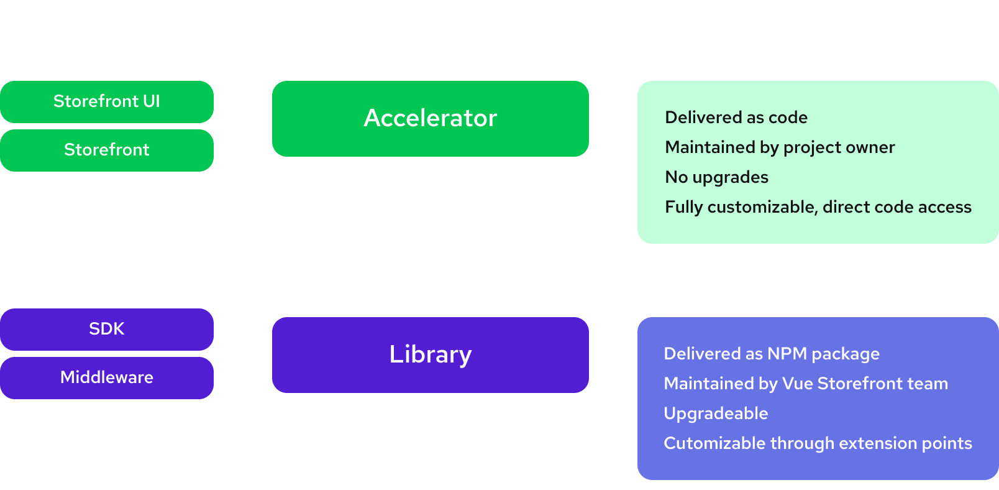

# Extensibility

Headless and Composable architectures are for tailored solutions. Instead of living with trade-offs of your monolithic eCommerce vendor you're choosing more granular tools that are best-suited to your needs. This way you can work more effectvely than your competitors.

Same rule applies to your storefront. This is the part of the system that your customers will interact with the most. Instead of showing them a generic storefront with mediocre performace you have a chance to stand out and deliver outstanding user experience that they'll remember.

## Vue Storefront is built for custom use-cases

After browsing countless landing pages of WYSIWYG Page Builders developers often come to the conslusion that currently available tools are too limiting and the only way to achieve outstanding user experience is building the storefront from scratch.

While this idea could sound tempting at first glance it often leads to the opposite effect. Developers tend to oversimplify the effort and complexity of building a storefront and the end result often costs more, takes more time to finish and the final result is far from what they hoped it to be.

We've built Vue Storefront precisely for this kind of developer. **With Vue Storefront you are able to build the same things that you could make from scratch. You build them faster and mitigate the risk associated with key architectural decisions and implementing them by yourself.**

## High-level Extensibility

We are in the eCommerce business more than we remember, and we know that different elements of eCommerce architecture need different levels of customization. To balance acceleration coming from simplification with the ability to build custom experiences, we grouped our products into two categories:

- **Black Box** - libraries offering easy-to-use abstractions over previously complicated elements of headless architecture. They are customized through extension points that allow to alter default behaviour, add custom one or hook into application lifecycle.
- **White Box** - accelerators that save you from generic and repetitive groundwork and provide direct access to the code. Once you set up the app, this becomes your own code.



Your Vue Storefront project will be a mix of both. Let’s see how it translates to application layers:


The whole storefront layer is just a boilerplate. You have direct access to the source code. You can remove, edit and add components, hooks, pages, plugins, etc. There are no limitations.

Non-UI elements of third-party integrations are part of SDK and Middleware and do not expose their source code to the project. Most of their default behavior can be easily customized through extensions though.  

Let’s see how they work!

## Extending Integrations

### Extending SDK

```jsx
const sdkExtension = {
  interceptors: [],
  utils: {},
  extend: {},
  override: {},
  subscribers: {}
};
```

- `interceptors` -
- `utils` -
- `extend` -
- `override` -
- `subscribers` -

```jsx
import { initSDK, buildModule } from '@vue-storefront/sdk';
import { sapccModule, SAPCCModuleType } from '@vsf-enterprise/sapcc-sdk';
// our custom extension
**import { sdkExtension } from './sapccExtension';**

const sdkConfig = {
  sapcc: buildModule(
		sapccModule, 
		{ apiUrl: "http://localhost:8181/sapcc" },
    **sdkExtension**
  ),
};

export const sdk = initSDK(sdkConfig);
```

You can read more about SDK Extensions and find real-world examples of its usage here

### Extending Middleware

- `extendApiMethods` -
- `extendApp` -
- `hooks` -