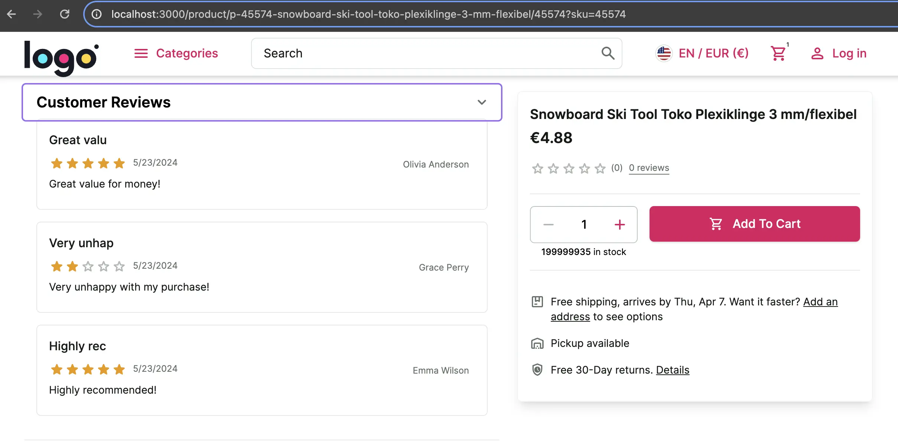

# Overriding API methods / Getting product reviews from an external source

Alokai Middleware is called an orchestration layer - it's responsible for combining data from different sources and
presenting it to the front end in a simple form. In this chapter, we will tackle a common business case - fetching reviews
from an external system. It is a common scenario that product reviews are managed by a dedicated service rather than the
eCommerce platform.

Thanks to the Unified Data Model we won't need to touch the front end at all to implement this.

1. Open `apps/storefront-middleware/integrations/sapcc/extensions/unified.ts` and add this code:

<!-- Related code: https://github.com/vsf-customer/extensibility-demo/blob/main/apps/storefront-middleware/integrations/sapcc/extensions/unified.ts#L9 -->
```diff [apps/storefront-middleware/integrations/sapcc/extensions/unified.ts]
+ interface DummyReview {
+   rating: number;
+   comment: string;
+   date: string;
+   reviewerName: string;
+   reviewerEmail: string;
+ }
+ interface DummyProduct {
+   reviews: DummyReview[];
+ }

// ...

export const unifiedApiExtension = createUnifiedExtension({

 // ...

+  methods: {
+    override: {
+      getProductReviews: async (context, args) => {
+        const product: DummyProduct = await (
+          await fetch(`https://dummyjson.com/products/${args.productId.slice(0, 2)}`)
+        ).json();
+        const reviews: SfProductReview[] = product.reviews.map((review) => ({
+          id: crypto.randomUUID().toString(),
+          createdAt: review.date,
+          rating: review.rating,
+          reviewer: review.reviewerName,
+          text: review.comment,
+          title: review.comment.slice(0, 10),
+        }));
+        return {
+          pagination: {
+            currentPage: 1,
+            pageSize: reviews.length,
+            totalPages: 1,
+            totalResults: reviews.length,
+          },
+          reviews: reviews,
+        };
+      },
+    },
+  },
```

What we do here is overwrite the OOTB `getProductReviews` that by default fetches reviews from the eCommerce platform.
We used [DummyJSON API](https://dummyjson.com) to fetch some random product data and extract reviews from it. Imagine that it could be any review
service. Then we transform the proprietary data model into the Unified Data Model.

2. Open a product page and expand "Customer Reviews". You should see some random reviews now.



3. To make our code more scalable we can extract the new method from the `unified.ts` file with the help of the `defineApi`
function.

```ts 
const getProductReviews = defineApi.getProductReviews(async (context, args) => {
  // function body
});
```

You can find a complete project example in this repository: <https://github.com/vsf-customer/extensibility-demo>
If you want to get access to it, contact our [sales team](https://docs.alokai.com/enterprise).

[Learn more about overriding API methods](https://docs.alokai.com/storefront/integration-and-setup/overriding-api-methods)
